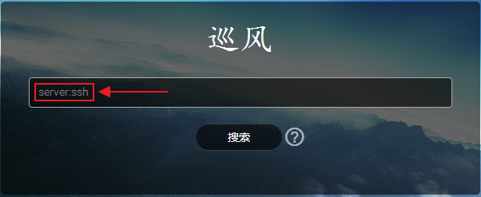
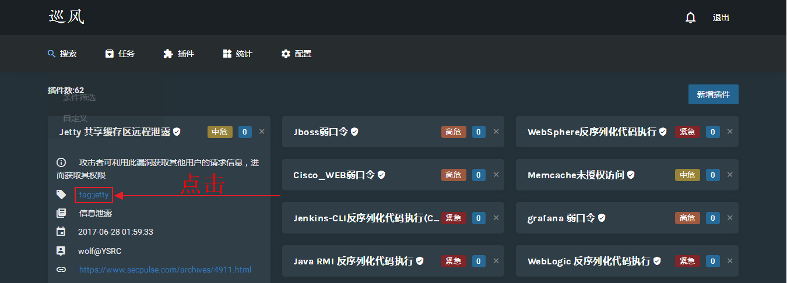
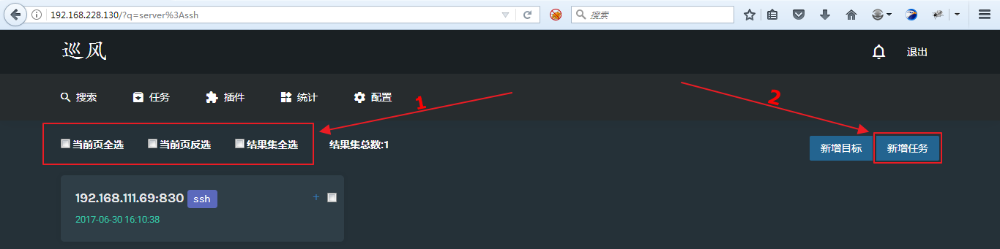
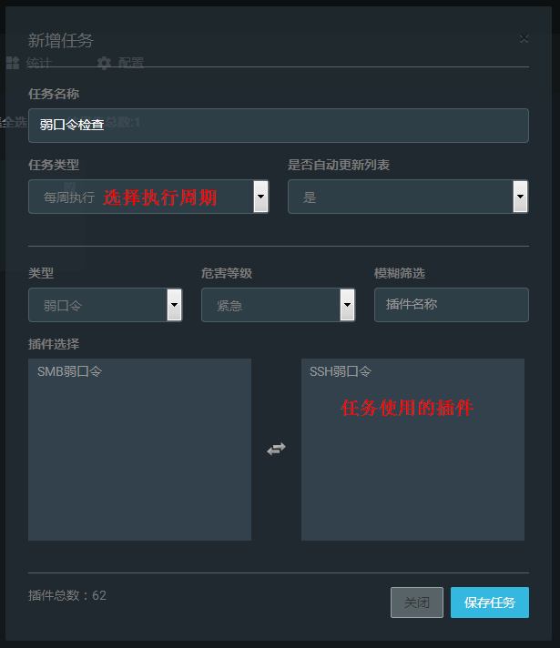
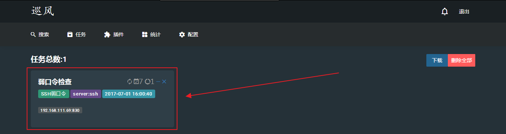
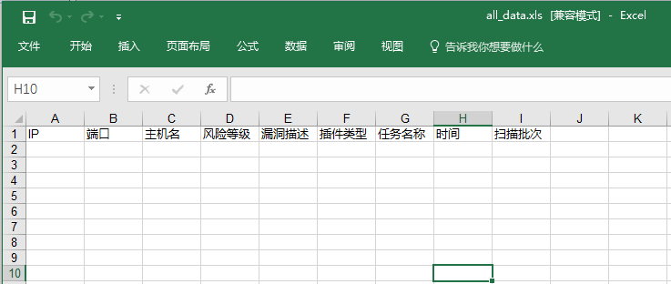

# 巡风之任务功能

任务功能是建立在巡风扫描系统已经有资产的基础上，使用搜索功能搜索出目标主机，使用系统已有的插件进行周期性扫描。

步骤：

1. 利用搜索功能搜索出目标主机

   
   或进入插件功能

   
2. 添加任务

   
3. 填写任务各个项信息

   

4. 保存
    

## 问题
### 任务扫描的结果在哪里查看？
答：在任务页面有个下载按钮，可以下载所有任务的扫描结果。
